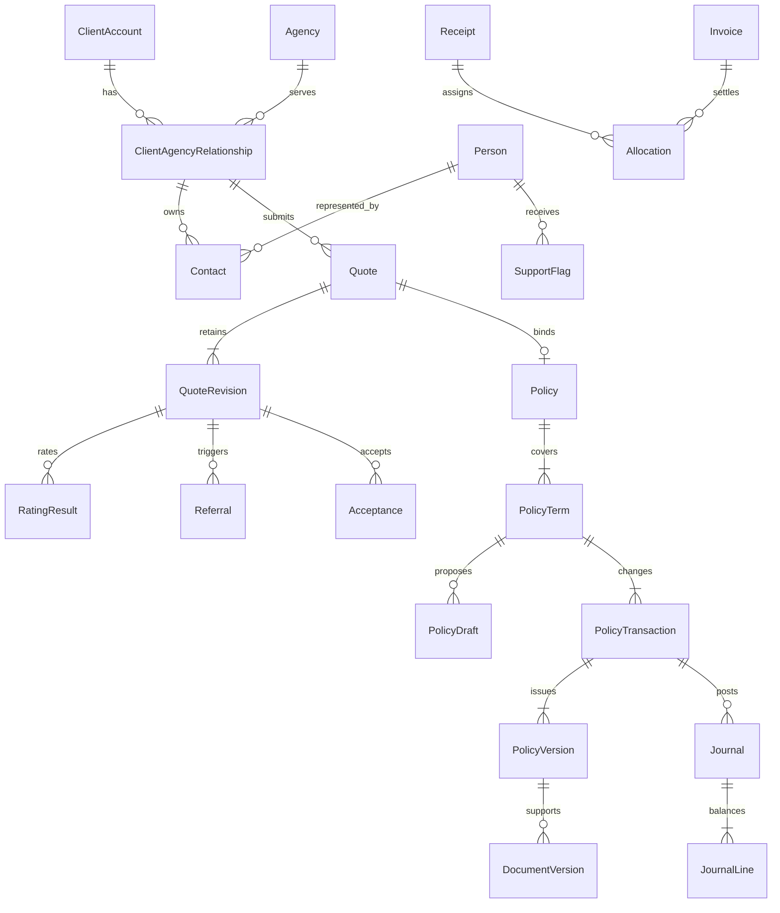

# Data model v1

Status: Phase 1 design, not deployed schema. SQL Server is authoritative. Application/EF migrations implement these contracts in Phase 2 and feature phases. `contracts/schemas/policy.schema.json` and `policy-draft.schema.json` own JSON shape; `contracts/examples/` contains three fictional examples.

## Types and common columns

Unless stated otherwise, each table has `Id uniqueidentifier NOT NULL` primary key, `CreatedAt datetimeoffset(7) NOT NULL` stored at offset zero and `CreatedBy uniqueidentifier NULL` FK to User. Mutable records add `UpdatedAt datetimeoffset(7) NOT NULL` and `RowVersion rowversion NOT NULL`. Issued/posted/history rows are append-only and have no general update endpoint. Never use a business reference as a database identity.

Notation below: UUID=uniqueidentifier, textN=nvarchar(N), json=nvarchar(max) with CHECK(ISJSON(column)=1), instant=datetimeoffset(7) UTC, date=date, money=decimal(19,2), rate=decimal(9,6), int=int, bool=bit, hash=binary(32). Unless `?` appears, fields are NOT NULL. Enum text uses CHECK constraints. Monetary values are GBP in v1; monetary aggregates carry Currency char(3) CHECK='GBP'. Store contractual instants with an explicit timezone ID and preserve the entered local date/time in transaction intent when required for audit. Never derive chronological order from UUID order.

## Relationship overview

## Identity and access

| Table | Domain-specific columns | Constraints/indexes |
|---|---|---|
| User | Email text254, NormalizedEmail text254, DisplayName text200, State text20, AgencyId UUID?, TeamId UUID?, SecurityStamp text100 | Unique NormalizedEmail; State invited/active/suspended; AgencyId FK Agency; TeamId FK Team |
| UserProfile | UserId UUID, FullName text200, Telephone text50, JobTitle text200, OutOfOffice bool, TaskDigest text30 | Unique UserId; digest daily-0800/twice-daily/off; out-of-office routes newly generated tasks only, existing tasks unchanged |
| UserCredential | UserId UUID, Provider text30, ProviderSubject text300, PasswordHash text1000?, MfaSecretCiphertext varbinary(max)?, MustReset bool | Unique (Provider,ProviderSubject); FK User; local passwords use framework password hasher; Entra adds mapping later |
| PasswordHistory | UserId UUID, PasswordHash text1000, ChangedAt instant | Index user/changed descending; retain last five framework hashes; verify candidate against current/recent hashes rather than comparing hashes or storing plaintext |
| Role | Code text60, Scope text20 | Unique Code; Scope internal/agency |
| UserRole | UserId UUID, RoleId UUID | Unique pair; role-mixing prohibited by transactional command |
| Team | Name text100 | Unique Name |
| Session | UserId UUID, TokenHash hash, ExpiresAt instant, RevokedAt instant?, LastSeenAt instant, DeviceLabel text200, SecurityStamp text100 | Unique TokenHash; index UserId/ExpiresAt; never persist raw session token |
| RecoveryCode | UserId UUID, CodeHash hash, ConsumedAt instant? | Unique (UserId,CodeHash); consume atomically |
| AuthenticationChallenge | UserId UUID, Purpose text30, TokenHash hash, ExpiresAt instant, ConsumedAt instant?, FailedAttempts int, SecurityStamp text100 | Purpose login-mfa/password-reset/recent-auth; unique TokenHash; check expiry, purpose, stamp and attempt limit while atomically consuming; no raw token |
| MfaEnrolment | UserId UUID, SecretCiphertext varbinary(max), DeviceName text100?, State text30, PendingRecoveryCodeHashes json, ExpiresAt instant, ConfirmedAt instant?, ActivatedAt instant?, FailedAttempts int, SecurityStamp text100 | One pending enrolment per user; pending/verified-pending-activation/activated/cancelled/expired; atomically enable UserCredential MFA only after verification and saved-code acknowledgement; destroy pending secret/hashes on cancellation or expiry |
| IdentityApproval | SubjectUserId UUID, RequestedBy UUID, ApprovedBy UUID?, Kind text30, OldValue json, ProposedValue json, Reason text1000, State text20, AppliedAt instant? | Approver differs from requester; pending/approved/rejected/applied; session revocation atomically accompanies application |
| AccountServiceRequest | UserId UUID, Kind text30, Details text2000, State text20, RoutedApprovalId UUID?, RoutedAt instant? | kind email/role-team/authority; open/routed/completed/rejected; requesting user plus authorised account administrators only; request never itself changes identity/access/authority |
| AccessChangeRequest | SubjectUserId UUID, RequestedBy UUID, ApprovedBy UUID?, ProposedRoleCodes json, ProposedTeamId UUID?, ProposedState text20, ReassignTasksToUserId UUID?, Reason text1000, State text20, AppliedAt instant? | Manager approval differs from requester; pending/approved/rejected/applied; apply role/team/state, session revocation and required active-task reassignment atomically; no direct access-update bypass |
| Invitation | UserId UUID, AgencyId UUID?, TokenHash hash, ExpiresAt instant, AcceptedAt instant?, RevokedAt instant?, SendJobId UUID? | Unique TokenHash; existing token invalidated on resend; user not active until accepted |

Credential implementation should use ASP.NET Core's supported hashing/authentication primitives; schema mapping must preserve those library requirements. Never manually invent password hashing. Ciphertext encryption keys live outside the database and repository. Account changes and MFA events generate audit records without secrets.

## Parties and distribution

| Table | Domain-specific columns | Constraints/indexes |
|---|---|---|
| ClientAccount | Reference text40, EntityType text30, LegalName text200, NormalizedName text200, CompanyNumber text30?, Address json, IdentityState text30 | Unique Reference; index CompanyNumber (filtered not null), NormalizedName; thin identity only |
| ClientAgencyRelationship | ClientId UUID, AgencyId UUID, State text20 | Unique pair, unique (Id,ClientId,AgencyId); all three FK scopes checked by dependants |
| Person | FullName text200, FirstName text100?, Surname text100?, DateOfBirth date? | Preserve declared full name; optional explicit name components, never guess by splitting; internal person identity, never public/global agency search |
| Contact | RelationshipId UUID, PersonId UUID, Role text100, Email text254?, Telephone text50?, IsPrimary bool, MarketingConsent json, EndedAt instant? | Unique filtered index RelationshipId WHERE IsPrimary=1 AND EndedAt IS NULL; FKs relationship/person; ending primary requires replacement or explicit empty active contact set |
| SupportFlag | PersonId UUID, OriginRelationshipId UUID, TypeCode text60, InternalCategory text100, InternalInstruction text2000, AgencyInstruction text1000?, ConsentBasis text200, ReviewOn date, EndedAt instant?, Reason text1000 | Index PersonId/ReviewOn; no flag columns in rating/bordereau projections |
| FlagVisibility | FlagId UUID, RelationshipId UUID | Unique pair; explicit sharing grant, no global agency visibility from person link |
| Agency | Reference text40, LegalName text200, RegulatoryReference text30, Address json, State text20, OnboardingStep int, MainContact json, ComplianceContact json, AccountsContact json, PaymentTermsDays int, CreditLimit money | Unique Reference; State draft/active/suspended/abandoned; Step 1..6; term/credit nonnegative |
| AgencyOnboarding | AgencyId UUID, Details json, SchemaVersion text30 | Unique AgencyId; typed AgencyWrite draft details own trading/entity/regulatory/contact/commercial/compliance/settlement answers; projected Agency columns update in the same transaction; verification claims must match AgencyEvidence before activation |
| AgencyTermsRequest | AgencyId UUID, RequestedBy UUID, ApprovedBy UUID?, EffectiveFrom date, ProposedTerms json, ProposedProducts json, Reason text1000, State text20, AppliedAt instant? | Independent approval for agreed commission changes; pending/approved/rejected/applied; published effective-dated terms append, never overwrite historic rating/settlement terms |
| AgencyTermsVersion | AgencyId UUID, Version int, EffectiveFrom instant, EffectiveTo instant?, ApprovedRequestId UUID?, Collector text20, SettlementMode text30, FeeShareBasisPoints int, CommissionBasis text20, FlatCommissionBasisPoints int? | Unique agency/version; no overlapping validity; collector agency/mga; settlement net-remittance/separate-payment; commission per-product/flat-rate; bps 0..10000; immutable after publication |
| AgencyStateRequest | AgencyId UUID, StateRequested text20, RequestedBy UUID, ApprovedBy UUID?, Reason text1000, State text20, AppliedAt instant? | Manager approves suspension separately; apply agency state/session revocation atomically; unique pending agency/state request |
| AgencyEvidence | AgencyId UUID, Kind text40, DocumentId UUID?, State text30, VerifiedAt instant?, AdapterAttemptId UUID?, Notes text1000 | Index AgencyId/Kind; separate format validation from verified outcome |
| AgencyProduct | AgencyId UUID, ProductVersionId UUID, EffectiveFrom instant, EffectiveTo instant?, BrokerCommissionRate rate | FK product version; rate 0..1; no overlapping applicable terms per agency/product |
| MatchReview | SubmissionQuoteId UUID, CandidateClientId UUID, RuleVersionId UUID, Signals json, Confidence text30, State text30, DecisionReason text1000?, DecidedBy UUID?, DecidedAt instant? | Index State; no automatic destructive merge; keep original submission snapshot |

Claim history can be linked at ClientAccount for internal matching context; it does not grant agency access to other agencies' incident records. Authorised agency projections provide only approved shared summaries, with provenance.

## Product/configuration versions

| Table | Domain-specific columns | Constraints/indexes |
|---|---|---|
| CapacityProvider | Code text50, Name text200, State text20 | Unique Code |
| Product | Code text60, Name text200 | Unique Code; road-risks, mt-combined, cc distinct |
| ProductVersion | ProductId UUID, Version int, State text20, EffectiveFrom instant, EffectiveTo instant?, ProviderId UUID, JsonSchemaVersion text30, QuestionSetVersion text60, Definition json | Unique product/version; draft/published/retired; non-overlapping published validity per product |
| BinderVersion | ProviderId UUID, ProductId UUID, Version int, ValidFrom instant, ValidTo instant, Limits json, ApprovalEvidenceDocumentId UUID? | Unique provider/product/version; ValidTo>ValidFrom |
| AuthorityVersion | ProductVersionId UUID, BinderVersionId UUID, Version int, EffectiveFrom instant, Rules json, ApprovedBy UUID, Reason text1000 | Unique product/version; all configured authority dimensions supported; no limit above binder |
| ReferenceDataVersion | Collection text100, Version text100, Source text500, SourceHash hash?, Rows json | Unique collection/version; immutable published rows with typed original IDs |
| RatingRuleVersion | ProductId UUID, Version int, State text20, EffectiveFrom instant, Definition json | Unique product/version; draft/published/retired; typed deterministic factors/conditions; historical results pin this ID |
| TemplateVersion | Code text100, Version int, Kind text20, ProductId UUID?, State text20, Content nvarchar(max), EffectiveFrom instant | Unique code/version; document/message; safe template language, no arbitrary execution |
| WorkflowRuleVersion | Code text100, Version int, EffectiveFrom instant, Definition json, State text20 | Unique code/version; event identity deduplicates generated tasks |
| SettingVersion | Scope text100, Version int, EffectiveFrom instant, Values json | Unique scope/version; no secrets; includes matching/notification/organisation/demo defaults |

JSON configuration is validated against a versioned schema, not an arbitrary admin payload. Reference/question definitions authorise allowed question IDs, answer kinds, units, applicability and allowed reference values. Unknown question IDs in a risk are rejected at rating/issue even if their primitive Answer shape is syntactically valid.

## Quotes and underwriting

| Table | Domain-specific columns | Constraints/indexes |
|---|---|---|
| Quote | Reference text40, RelationshipId UUID, ProductId UUID, State text30, CurrentRevisionId UUID?, AssignedUserId UUID?, WithdrawReason text1000?, ClonedFromQuoteRevisionId UUID?, ClonedFromPolicyVersionId UUID? | Unique Reference; index relationship/product/state; current revision FK must belong to quote; at most one clone source; cloning never grants source relationship access |
| QuoteRevision | QuoteId UUID, Number int, ProductVersionId UUID, ProposalJson json, ContentHash hash, SchemaVersion text30, SavedAt instant | Unique quote/number; append-only revision snapshots; incomplete JSON uses draft schema |
| RatingResult | QuoteRevisionId UUID?, DraftId UUID?, DraftRevision int?, InputHash hash, RuleVersion text100, ExpiresAt instant, ResultJson json, State text30, AttemptId UUID | Exactly one quote or draft target; index target/hash; completed result immutable |
| Referral | QuoteRevisionId UUID?, DraftId UUID?, RuleCode text100, AuthorityVersionId UUID, Reason text2000, State text30, AssignedUserId UUID?, RequiredAuthority json | Exactly one target; unique target/rule/rating identity |
| ReferralDecision | ReferralId UUID, Outcome text30, Conditions json, Reason text2000, EvidenceDocumentId UUID?, ActorId UUID, DecidedAt instant, TargetHash hash | Append-only; requestor/actor permissions checked; decisions bind exact target hash |
| ReferralConditionEvidence | ReferralDecisionId UUID, ConditionId UUID, TargetHash hash, EvidenceDocumentVersionId UUID, Satisfied bool, Reason text1000, ActorId UUID, RecordedAt instant | Append-only evidence decisions; index decision/condition/time; no satisfaction survives a changed target hash |
| ProposalEvidence | QuoteRevisionId UUID?, DraftId UUID?, DraftRevision int?, DocumentVersionId UUID, RequirementCode text100, RiskItemId UUID?, State text20, Reason text1000 | Exactly one quote/draft target; pending/accepted/rejected/withdrawn; RiskItemId belongs to the target revision and is required for item-scoped requirements; preserve revision and file lineage; never implicitly authorise issue |
| Escalation | ReferralId UUID, ProviderId UUID, State text30, ProviderReference text100?, RequestJobId UUID? | FK referral/provider; context pins binder/authority version |
| EscalationMessage | EscalationId UUID, Direction text10, AuthorLabel text200, Body text8000, Outcome text40?, RecordedAt instant, AttemptId UUID? | Append-only inbound/outbound thread |
| Acceptance | QuoteRevisionId UUID?, DraftId UUID?, DraftRevision int?, RatingResultId UUID, TermsHash hash, AcceptedByLabel text200, AcceptedAt instant, Channel text30, EvidenceDocumentId UUID? | Exactly one target; immutable acceptance evidence |

## Policy lifecycle and projections

| Table | Domain-specific columns | Constraints/indexes |
|---|---|---|
| Policy | Reference text40, RelationshipId UUID, ProductId UUID, OriginQuoteId UUID?, State text30 | Unique Reference and filtered OriginQuoteId for bind dedupe; state projection, history authoritative |
| PolicyTerm | PolicyId UUID, TermNumber int, Kind text20, StartsAt instant, EndsAt instant, TimeZone text60, PreviousTermId UUID? | Unique policy/term; Kind annual/short-period; EndsAt>StartsAt; no overlapping issued terms |
| PolicyDraft | TermId UUID, Kind text30, Revision int, BaseVersionId UUID, EffectiveAt instant, ProposedTermEnd instant?, ProposalJson json, CoverChangeSchedule json, DateBasis text20, ContentHash hash, State text30, RequestedBy text200, Reason text1000?, CancellationReasonCode text100?, IssuedTransactionId UUID? | Kind MTA/renewal/cancellation; DateBasis shared/per-cover-change; mutable optimistic concurrency; base belongs to term; schedule part of hash/rating/acceptance |
| EditLease | DraftId UUID, HolderUserId UUID, TokenHash hash, ExpiresAt instant, TakenOverFrom UUID?, Reason text1000? | Unique DraftId; atomically compare expiry/token; lease is not write concurrency token |
| PolicyTransaction | TermId UUID, Sequence int, Kind text30, EffectiveAt instant, ProcessedAt instant, BaseVersionId UUID?, DraftId UUID?, QuoteRevisionId UUID?, RatingResultId UUID?, AcceptanceId UUID?, Reason text1000, OperationKey text200 | Unique term/sequence, unique OperationKey, unique filtered DraftId; append-only |
| PolicyVersion | TermId UUID, TransactionId UUID, SliceOrdinal int, Sequence int, EffectiveAt instant, ProcessedAt instant, SnapshotJson json, SchemaVersion text30, ContentHash hash | Unique transaction/slice and term/sequence; index term/effective/processed; immutable; one full snapshot per distinct effective instant within transaction |
| RiskSearchProjection | VersionId UUID, RiskItemId UUID, Kind text30, SearchValue text200, NormalizedValue text200 | Unique version/item/kind; index kind/normalized; FKs exact version; rebuilt from JSON |

Transaction Sequence is processing order within a term. PolicyVersion Sequence is a separate monotonically allocated version sequence; SliceOrdinal orders dated snapshots inside one transaction. A multi-date MTA has one PolicyTransaction and multiple PolicyVersions committed together. Version selection uses LIFE-01 rules in LIFECYCLE.md. Concurrency protection includes an update to the Policy aggregate rowversion during issue to serialize competing policy-wide commands (e.g. MTA vs renewal/cancel). Restrict application roles from general UPDATE/DELETE on issued snapshot and posted journal tables; migrations/controlled maintenance use a separate credential.

## Operational records and file storage

| Table | Domain-specific columns | Constraints/indexes |
|---|---|---|
| WorkRecord | Kind text30 | Supertype for quote, policy, task, agency, match, incident. Each business table has unique WorkRecordId FK; permits constrained common links. |
| Task | WorkRecordId UUID, SubjectRecordId UUID, TypeCode text60, Priority text20, State text30, OwnerId UUID?, TeamId UUID?, DueAt instant?, Title text300, Checklist json, CompletionReason text1000?, WorkflowEventKey text200? | Unique filtered WorkflowEventKey; index owner/state/due; subject FK WorkRecord |
| Note | SubjectRecordId UUID, Body text8000, Visibility text20 | Internal only; append-only edits as NoteRevision if editing is exposed |
| Thread | SubjectRecordId UUID, RelationshipId UUID?, Visibility text20, Subject text300 | Internal/agency; relation required for agency sharing |
| Message | ThreadId UUID, AuthorId UUID, Body text8000, State text20, RecipientSnapshot json, SentAt instant?, SendJobId UUID? | Draft/queued/sent/failed; immutable after queued except delivery state |
| Document | SubjectRecordId UUID, Kind text50, Visibility text20, RelationshipId UUID?, CurrentVersionId UUID? | Authorised file metadata; current version must belong to document |
| DocumentVersion | DocumentId UUID, Number int, PolicyVersionId UUID?, QuoteRevisionId UUID?, TemplateVersionId UUID?, StorageKey text500, Sha256 hash, Bytes bigint, ContentType text200, OriginalName text255, WithdrawnEffectiveAt instant? | Unique doc/number; bytes nonnegative; storage key internal; original bytes immutable |
| MessageAttachment | MessageId UUID, DocumentVersionId UUID | Unique pair; both records visible to message audience |
| Incident | WorkRecordId UUID, PolicyId UUID, VersionId UUID, RiskItemId UUID?, Kind text50, OccurredOn date, ApproximateLocalTime time?, OccurredAt instant?, Description text8000, Contact json, Details json, State text30, ProviderId UUID?, ProviderReference text100? | FK policy/version association; draft/logged/queued/handed-off/failed |
| ClaimsSummary | IncidentId UUID, AsOf instant, Status text30, Paid money, Reserved money, ProviderPayload json, AttemptId UUID | Append-only provider snapshots; not local claim settlement authority |
| MidSubmission | PolicyVersionId UUID, RiskItemId UUID, Registration text20, Action text10, EffectiveAt instant, State text20, ProviderReference text100?, ReasonCodes json, JobId UUID | Unique (PolicyVersionId,RiskItemId,Action); add/change/remove; pending/accepted/rejected/failed; separate attempt history; no retargeting later versions |
| LookupEvidence | Kind text30, SubjectRecordId UUID?, ReferenceDataVersionId UUID, QueryHash hash, Result json, AsOf instant, ExpiresAt instant, JobId UUID | Immutable typed result; index subject/kind/time; lookup success is evidence, not declaration acceptance |

WorkRecord supertype resolves earlier generic-link concern: enforce unique typed parent registration in an atomic application operation, plus FK to WorkRecord for shared records. A cleanup integrity check detects any unowned WorkRecord. Never expose an endpoint accepting arbitrary entity-type strings without validating the actual typed parent and permission.

Files use a persistent local volume initially. Upload writes a temporary object and hash, then commits metadata; promote/finalise via durable job, with unavailable content clearly marked until ready. Recover or clean abandoned objects using a grace period, never delete a referenced issued file. Authorise every download and avoid exposing raw storage paths.

## Financial records

| Table | Domain-specific columns | Constraints/indexes |
|---|---|---|
| AccountingPeriod | StartsOn date, EndsOn date, State text20, ClosedAt instant?, ClosedBy UUID? | Unique range; open/closed; no overlaps |
| LedgerAccount | Code text60, Kind text30, AgencyId UUID?, ProviderId UUID? | Unique Code; control/income/cash/receivable/payable |
| Journal | TransactionId UUID?, PeriodId UUID, PostedAt instant, EffectiveOn date, OperationKey text200, ReversesJournalId UUID?, Reason text1000, Currency char3 | Unique OperationKey; immutable after posted |
| JournalLine | JournalId UUID, Number int, AccountId UUID, Debit money, Credit money | Unique journal/number; exactly one strictly positive debit or credit; journal debit sum=credit sum enforced in posting transaction |
| PremiumMovement | TransactionId UUID, JournalId UUID, SourceMovementId UUID?, StartsOn date, EndsOn date, Premium money, Tax money, BrokerCommission money, Fee money, BrokerFeeShare money, MgaFeeIncome money, TermsVersionId UUID, Currency char3, RuleVersion text100 | EndsOn>StartsOn; signed posted components; fee=brokerFeeShare+mgaFeeIncome; index transaction and source; cancellation returns preserve original component interval/rates; unique (TransactionId,SourceMovementId) when source present |
| Invoice | AgencyId UUID, TransactionId UUID, Kind text20, Reference text40, Gross money, BrokerCommission money, BrokerFeeShare money, NetDue money, InvoiceDue money, RemunerationPayable money, DebtorKind text20, DebtorRelationshipId UUID?, TermsVersionId UUID, DueOn date, JournalId UUID | Unique reference/transaction; NetDue=Gross-BrokerCommission-BrokerFeeShare; InvoiceDue follows actual collector/settlement; client debtor requires scoped relationship; credit-note components signed negative |
| BrokerRemuneration | AgencyId UUID, TransactionId UUID, TermsVersionId UUID, Commission money, FeeShare money, Amount money, SettledAmount money, JournalId UUID | Unique transaction; separate-settlement obligation; amount=commission+feeShare; signed clawback supported; settlement cannot exceed eligible residual |
| PaymentSettlement | RefundId UUID?, BrokerRemunerationId UUID?, Amount money, Currency char3, OperationKey text200, State text20, JobId UUID, JournalId UUID?, CompletedAt instant? | Exactly one obligation; amount>0; unique OperationKey; reserved/queued/paid/failed; reserve/check obligation residual atomically; confirmed provider outcome and one cash journal apply together |
| Receipt | AgencyId UUID?, PayerKind text20, RelationshipId UUID?, Amount money, ReceivedOn date, BankReference text200, Currency char3, JournalId UUID?, OperationKey text200 | Amount>0; unique OperationKey; payer unidentified/agency/client; client payer requires matching relationship/agency; unidentified cannot allocate |
| Allocation | ReceiptId UUID, InvoiceId UUID, Amount money, ReversalOfId UUID?, Reason text1000 | Amount>0; append/reversal; lock/check receipt and invoice residuals atomically |
| Refund | AgencyId UUID, TransactionId UUID, PayeeKind text20, PayeeRelationshipId UUID?, Amount money, State text30, ApprovedBy UUID?, ApprovalReason text1000?, PaymentOperationKey text200?, PaymentAttemptId UUID? | Unique transaction/refund-purpose; Amount>0; agency/client payee based on collected credit; client requires relationship; pending/approved/rejected/queued/paid/failed |
| BankLine | Reference text200, OccurredOn date, Amount money, Currency char3, ImportKey text200 | Unique ImportKey; immutable import |
| BankLineExclusion | BankLineId UUID, DuplicateOfBankLineId UUID, Reason text1000, ActorId UUID, RecordedAt instant | Unique BankLineId; distinct lines, same amount/currency/reference evidence required; no matched line may be excluded; append-only audit preserves imported bytes |
| Reconciliation | PeriodId UUID, State text20, Reason text1000? | No completion with unexplained variance |
| ReconciliationMatch | ReconciliationId UUID, BankLineId UUID, JournalLineId UUID, Amount money, ReversalOfId UUID?, Reason text1000 | Amount>0; append-only original/reversal; unique filtered ReversalOfId prevents reversing twice; totals cannot overmatch; lock original on reversal |
| BordereauBatch | ProviderId UUID, PeriodId UUID, Number int, State text30, ContentHash hash?, SubmitJobId UUID?, CorrectsBatchId UUID? | Unique provider/period/number; immutable after submitted; correction FK must refer to same provider and a submitted batch |
| BordereauRow | BatchId UUID, TransactionId UUID, Snapshot json, ValidationErrors json, Excluded bool, ExclusionReason text1000? | Unique batch/transaction; excluded requires reason; pin exported source snapshot |
| BordereauRowCorrection | RowId UUID, PolicyReference text40?, ProviderProductCode text100?, AgencyReference text40?, Reason text1000, ActorId UUID, RecordedAt instant | Append-only draft export mapping correction; cannot change contractual premium/tax/commission; only unsubmitted batch; revalidation required |

## Platform/read models

| Table | Domain-specific columns | Constraints/indexes |
|---|---|---|
| AuditEvent | ActorId UUID?, SubjectRecordId UUID?, EventType text100, OccurredAt instant, Reason text1000?, Before json?, After json?, CorrelationId UUID | Append-only; index subject/time and actor/time; redact secrets and restricted fields by event schema |
| OutboxWork | Kind text60, SubjectRecordId UUID?, OperationKey text200, Payload json, State text20, NextAttemptAt instant, LeaseExpiresAt instant?, Attempts int, Result json? | Unique kind/OperationKey; pending/leased/succeeded/failed; lease and update atomic |
| AdapterAttempt | WorkId UUID, AttemptNumber int, StartedAt instant, EndedAt instant?, Outcome text30, Request json, Response json?, ErrorCode text100? | Unique work/attempt; redact before storage; no secrets |
| DemoProviderOperation | Kind text60, OperationKey text200, RequestHash hash, ScenarioVersionId UUID, State text30, Result json?, CompletedAt instant? | Unique kind/key; commits independently of local worker outcome to model provider success before timeout; FK scenario version to SettingVersion |
| AdapterInbox | Provider text60, EventId text200, ContentHash hash, WorkId UUID, State text20, AppliedAt instant?, QuarantineReason text1000? | Unique provider/event; received/applied/quarantined; event application and business result commit together; mismatched duplicate hash cannot overwrite applied content |
| IdempotencyRecord | ActorScope text150, Route text200, Key text200, RequestHash hash, ResultStatus int, ResultBody json, ExpiresAt instant | Unique scope/route/key; command result and domain effect committed together; paid/issued operation uniqueness lasts beyond cache expiry |
| SavedReport | UserId UUID, ReportCode text60, Name text200, Filters json, IsFavourite bool, LastRunAt instant? | Index user/favourite; server validates filter schema |
| ReportDefinitionVersion | Code text60, Version int, Title text200, Measures json, FilterSchemaVersion text30, DefaultBasis text20, EffectiveFrom instant | Unique code/version; named report definitions seeded and immutable; effective/processed basis; definitions use allowlisted measures, never user SQL |
| ReportRun | DefinitionVersionId UUID, UserId UUID, Filters json, AccessScopeHash hash, AsOf instant, ResultStorageKey text500?, ExpiresAt instant, ExportJobId UUID? | Immutable pinned run; cursor binds run and ordering; result download reauthorises current scope; contains only scoped projection |
| Notification | UserId UUID, SubjectRecordId UUID?, Kind text60, Text text1000, ReadAt instant?, EventKey text200 | Unique user/event; visible only when underlying subject remains authorised |

## Retention, concurrency and migration

Prototype audit retention defaults to seven years after term end; encode as configurable demo policy, not a legal assertion. No automated destructive retention purge in the MVP. Identity secrets/session tokens expire independently; discarded draft files can be cleaned after a documented grace period only if unreferenced. Support flags retain restricted provenance but avoid unnecessary diagnosis text.

All FK deletes default NO ACTION; deactivate/supersede financial or contractual records. Mutable aggregate writes require ETags. Transaction-scoped locks/serialisable checks protect non-row invariants such as no overlapping published versions, allocations and term overlap. Rowversion alone on one child row does not protect an aggregate sum.

Migration testing must start from an empty SQL Server and a seeded previous schema, apply forward migrations and verify constraints; rollback strategy uses backups/restores for destructive changes. This document and schema validation are not evidence that SQL constraints have run yet.
