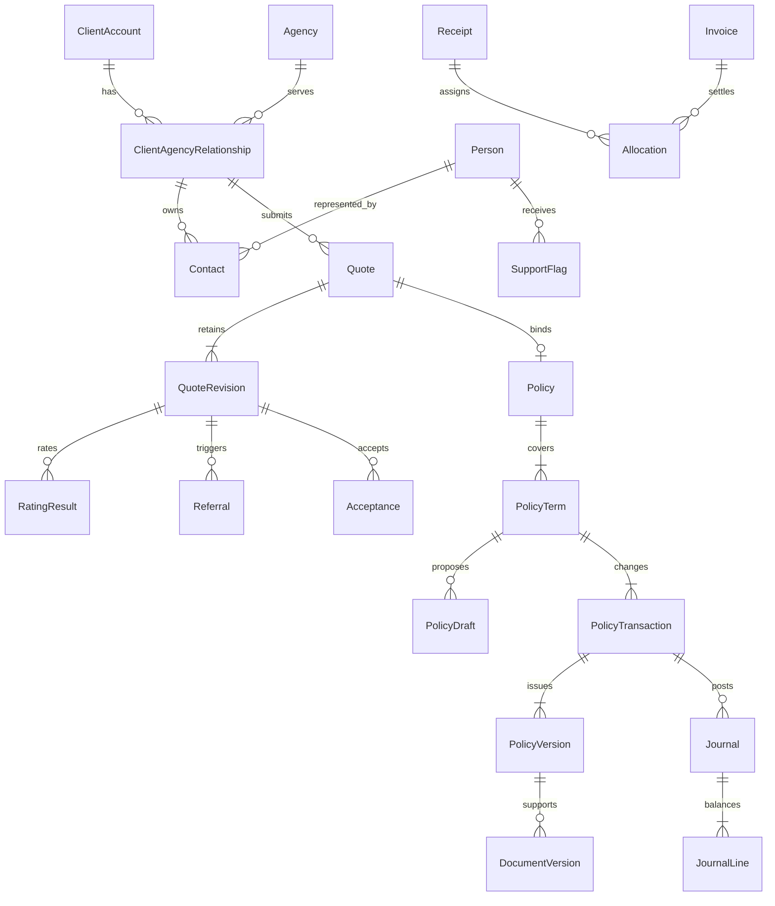

# Data model v1

Status: Phase 1 design, not deployed schema. SQL Server is authoritative. Application/EF migrations implement these contracts in Phase 2 and feature phases. `contracts/schemas/policy.schema.json` and `policy-draft.schema.json` own JSON shape; `contracts/examples/` contains three fictional examples.

## Types and common columns

Unless stated otherwise, each table has `Id uniqueidentifier NOT NULL` primary key, `CreatedAt datetimeoffset(7) NOT NULL` stored at offset zero and `CreatedBy uniqueidentifier NULL` FK to User. Mutable records add `UpdatedAt datetimeoffset(7) NOT NULL` and `RowVersion rowversion NOT NULL`. Issued/posted/history rows are append-only and have no general update endpoint. Never use a business reference as a database identity.

Notation below: UUID=uniqueidentifier, textN=nvarchar(N), json=nvarchar(max) with CHECK(ISJSON(column)=1), instant=datetimeoffset(7) UTC, date=date, money=decimal(19,2), rate=decimal(9,6), int=int, bool=bit, hash=binary(32). Unless `?` appears, fields are NOT NULL. Enum text uses CHECK constraints. Monetary values are GBP in v1; monetary aggregates carry Currency char(3) CHECK='GBP'. Store contractual instants with an explicit timezone ID and preserve the entered local date/time in transaction intent when required for audit. Never derive chronological order from UUID order.

## Relationship overview

## Identity and access

| Table | Domain-specific columns | Constraints/indexes |
|---|---|---|
| User | Email text254, NormalizedEmail text254, DisplayName text200, State text20, AgencyId UUID?, TeamId UUID?, SecurityStamp text100 | Unique NormalizedEmail; State invited/active/suspended; AgencyId FK Agency; TeamId FK Team |
| UserProfile | UserId UUID, FullName text200, Telephone text50, JobTitle text200, OutOfOffice bool, TaskDigest text30 | Unique UserId; digest daily-0800/twice-daily/off; out-of-office routes newly generated tasks only, existing tasks unchanged |
| UserCredential | UserId UUID, Provider text30, ProviderSubject text300, PasswordHash text1000?, MfaSecretCiphertext varbinary(max)?, MustReset bool | Unique (Provider,ProviderSubject); FK User; local passwords use framework password hasher; Entra adds mapping later |
| PasswordHistory | UserId UUID, PasswordHash text1000, ChangedAt instant | Index user/changed descending; retain last five framework hashes; verify candidate against current/recent hashes rather than comparing hashes or storing plaintext |
| Role | Code text60, Scope text20 | Unique Code; Scope internal/agency |
| UserRole | UserId UUID, RoleId UUID | Unique pair; role-mixing prohibited by transactional command |
| Team | Name text100 | Unique Name |
| Session | UserId UUID, TokenHash hash, ExpiresAt instant, RevokedAt instant?, LastSeenAt instant, DeviceLabel text200, SecurityStamp text100 | Unique TokenHash; index UserId/ExpiresAt; never persist raw session token |
| RecoveryCode | UserId UUID, CodeHash hash, ConsumedAt instant? | Unique (UserId,CodeHash); consume atomically |
| AuthenticationChallenge | UserId UUID, Purpose text30, TokenHash hash, ExpiresAt instant, ConsumedAt instant?, FailedAttempts int, SecurityStamp text100 | Purpose login-mfa/password-reset/recent-auth; unique TokenHash; check expiry, purpose, stamp and attempt limit while atomically consuming; no raw token |
| MfaEnrolment | UserId UUID, SecretCiphertext varbinary(max), DeviceName text100?, State text30, PendingRecoveryCodeHashes json, ExpiresAt instant, ConfirmedAt instant?, ActivatedAt instant?, FailedAttempts int, SecurityStamp text100 | One pending enrolment per user; pending/verified-pending-activation/activated/cancelled/expired; atomically enable UserCredential MFA only after verification and saved-code acknowledgement; destroy pending secret/hashes on cancellation or expiry |
| IdentityApproval | SubjectUserId UUID, RequestedBy UUID, ApprovedBy UUID?, Kind text30, OldValue json, ProposedValue json, Reason text1000, State text20, AppliedAt instant? | Approver differs from requester; pending/approved/rejected/applied; session revocation atomically accompanies application |
| AccountServiceRequest | UserId UUID, Kind text30, Details text2000, State text20, RoutedApprovalId UUID?, RoutedAt instant? | kind email/role-team/authority; open/routed/completed/rejected; requesting user plus authorised account administrators only; request never itself changes identity/access/authority |
| AccessChangeRequest | SubjectUserId UUID, RequestedBy UUID, ApprovedBy UUID?, ProposedRoleCodes json, ProposedTeamId UUID?, ProposedState text20, ReassignTasksToUserId UUID?, Reason text1000, State text20, AppliedAt instant? | Manager approval differs from requester; pending/approved/rejected/applied; apply role/team/state, session revocation and required active-task reassignment atomically; no direct access-update bypass |
| Invitation | UserId UUID, AgencyId UUID?, TokenHash hash, ExpiresAt instant, AcceptedAt instant?, RevokedAt instant?, SendJobId UUID? | Unique TokenHash; existing token invalidated on resend; user not active until accepted |

Credential implementation should use ASP.NET Core's supported hashing/authentication primitives; schema mapping must preserve those library requirements. Never manually invent password hashing. Ciphertext encryption keys live outside the database and repository. Account changes and MFA events generate audit records without secrets.

## Parties and distribution

| Table | Domain-specific columns | Constraints/indexes |
|---|---|---|
| ClientAccount | Reference text40, EntityType text30, LegalName text200, NormalizedName text200, CompanyNumber text30?, Address json, IdentityState text30 | Unique Reference; index CompanyNumber (filtered not null), NormalizedName; thin identity only |
| ClientAgencyRelationship | ClientId UUID, AgencyId UUID, State text20 | Unique pair, unique (Id,ClientId,AgencyId); all three FK scopes checked by dependants |
| Person | FullName text200, FirstName text100?, Surname text100?, DateOfBirth date? | Preserve declared full name; optional explicit name components, never guess by splitting; internal person identity, never public/global agency search |
| Contact | ClientId UUID, RelationshipId UUID, PersonId UUID, DeclaredFullName text200, NormalizedName text200, DeclaredFirstName text100?, DeclaredSurname text100?, Role text100, Email text254?, Telephone text50?, IsPrimary bool, MarketingConsent json, EndedAt instant?, EndedBy UUID?, EndReason text1000? | Unique filtered index RelationshipId WHERE IsPrimary=1 AND EndedAt IS NULL; composite relationship/client FK plus person/user FKs; declared names belong to this relationship, not shared Person edits; ending primary requires replacement or explicit empty active contact set |
| SupportFlag | ClientId UUID, PersonId UUID, OriginRelationshipId UUID, TypeCode text60, InternalCategory text100, InternalInstruction text2000, AgencyInstruction text1000?, ConsentBasis text200, ReviewOn date, EndedAt instant?, EndedBy UUID?, Reason text1000 | Index PersonId/ReviewOn; composite origin/client FK; no flag columns in rating/bordereau projections |
| FlagVisibility | FlagId UUID, ClientId UUID, RelationshipId UUID | Unique flag/relationship pair; composite flag/client and relationship/client FKs; explicit sharing grant, no global agency visibility from person link |
| Agency | Existing identity plus normalized name, optional onboarding projections and mutable RowVersion | Phase 4 dictionary below; existing IDs/references preserved |
| AgencyOnboarding | AgencyId UUID, Details json, SchemaVersion text30 | Unique agency; strict partial declarations, never verification authority |
| AgencyTermsRequest | Immutable complete proposed snapshot, base version and independent decision | Pending/applied/rejected/stale; no approved-but-unapplied state |
| AgencyTermsVersion | Immutable version, effective business date, approved request and complete terms snapshot | Unique agency/version and agency/effective date; derive end from successor |
| AgencyStateRequest | Activation/suspension/reactivation proposal, base version and independent decision | Approval and state/session effects commit together |
| AgencyEvidence | Immutable scoped evidence with input fingerprint, rule and file provenance | Append attempts; current validation derives staleness/expiry |
| AgencyProduct | TermsVersionId UUID, ProductVersionId UUID, EffectiveFrom date, BrokerCommissionBasisPoints int | Unique version/product; bps 0..10000; draft selections stored separately |
| MatchSubmission | Reference text40, AgencyId UUID, IdentitySnapshot json, LinkedClientId UUID?, LinkedRelationshipId UUID?, SeparateClientId UUID? | Unique reference; immutable submitted identity; real QuoteId/FK added with Phase 5, absent before quote capture; composite relationship/client/agency FK constrains current association; first separately created account is retained across reopen/link |
| MatchReview | SubmissionId UUID, CandidateClientId UUID, CandidateRelationshipId UUID, RuleVersionId UUID, RuleSnapshot json, Signals json, Confidence text30, State text30 | One review per intake in this slice; composite candidate relationship/client FK; index State; immutable candidate/evidence/confidence and pinned matching-rule version; no automatic destructive merge |
| MatchDecision | MatchId UUID, Outcome text20, Reason text1000, ActorId UUID, OccurredAt instant, ClientId UUID?, RelationshipId UUID?, InformationRequestId UUID? | Append-only trail; every reopened decision retained; locked match/intake transaction; separate outcome reuses this intake's separately created identity |
| MatchInformationRequest | MatchId UUID, Description text1000, ActorId UUID, RecordedAt instant, DeliveryState text20 | Append-only recorded request; delivery state is constrained to recorded now. Phase 9 adds real demo delivery records/jobs and their state projection; no sent claim from mere creation |
| SupportFlagHistory | FlagId UUID, ActorId UUID, OccurredAt instant, Action text20, Reason text1000, Snapshot json | Append-only sensitive history with dedicated support permission; never serialized through broad client activity |
| ClientActivity | ClientId UUID, RelationshipId UUID?, ActorId UUID?, EventType text100, OccurredAt instant, RecordId UUID?, RecordKind text20? | Fixed reviewed summaries computed on read; scope before count/page; no raw support detail or free-text reason |

Phase 3 contact consent JSON uses MarketingConsent: required state given/withheld/not-asked, email/telephone booleans, recordedAt instant and source text200. Given requires at least one true channel; withheld/not-asked require both false. Preserve declared recording evidence separately from server audit actor/time. First contact is primary; parent relationship locks, ordered saves and the unique index enforce exactly one primary for a nonempty active set. A contact name edit changes its declaration only; canonical Person identity is not globally editable through contact APIs.

Contact storage adds a redundant ClientId to enforce the relationship/client pair in SQL, a separate normalized declared-name search key, and retained ending actor/reason. Person remains a shared identity; reuse requires an explicitly selected person with an accessible same-client contact, including retained ended contacts while their relationship is still accessible. This does not create a global person directory or share contact details. Declared consent instants normalize to UTC and cannot be future-dated; mutation audit records capture the actual actor/time independently. SQL checks enforce basic consent state/channel coherence, UTC and ending metadata, while typed input validation enforces the full request contract. The primary index enforces at most one; service locks and transitions must enforce the nonempty-set minimum before contact APIs are exposed.

Phase 3 seeds only the minimum Agency identity required for relationship foreign keys; Phase 4 extends the same identity with onboarding columns. Client references use a concurrency-safe sequence, not MAX+1. FlagVisibility grants are validated against active same-client relationships containing the person; sharing a Person grants no visibility. Declined-consent sensitive details do not persist. Fixed flag types/categories/bases in the Phase 3 API reproduce source choices; future configuration publication must update validation coherently.

Support storage adds ClientId to enforce origin/grant ownership pairs and EndedBy to retain the ending actor. SupportFlagHistory has required ActorId, UTC instant, bounded action/reason and JSON snapshot; a SQL trigger rejects updates/deletes. Internal flag/history queries require the dedicated support capability. Safe projection rechecks explicit grant, target relationship state and active target person contact on every query, returns only id/personId/instruction/reviewOn, and never derives a hidden-flag total. Validation requires today's or a future review date on writes (the service supplies the business date); existing overdue records remain readable. Instructions accept bounded multiline functional text, normalize line endings and reject hidden control characters. Unaccepted/declined consent is rejected before sensitive-field validation and must precede command hashing/persistence. These are MVP servicing rules, not legal certification. Lifecycle commands must lock all relevant relationships before validating membership, write immutable history in the same transaction, and cache only safe mutation IDs/ETags.

Claim history can be linked at ClientAccount for internal matching context; it does not grant agency access to other agencies' incident records. Authorised agency projections provide only approved shared summaries, with provenance.

## Product/configuration versions

| Table | Domain-specific columns | Constraints/indexes |
|---|---|---|
| CapacityProvider | Code text50, Name text200, State text20 | Unique Code |
| Product | Code text60, Name text200 | Unique Code; road-risks, mt-combined, cc distinct |
| ProductVersion | ProductId UUID, Version int, State text20, EffectiveFrom instant, EffectiveTo instant?, ProviderId UUID, JsonSchemaVersion text30, QuestionSetVersion text60, Definition json | Unique product/version; draft/published/retired; non-overlapping published validity per product |
| BinderVersion | ProviderId UUID, ProductId UUID, Version int, ValidFrom instant, ValidTo instant, Limits json, ApprovalEvidenceDocumentId UUID? | Unique provider/product/version; ValidTo>ValidFrom |
| AuthorityVersion | ProductVersionId UUID, BinderVersionId UUID, Version int, EffectiveFrom instant, Rules json, ApprovedBy UUID, Reason text1000 | Unique product/version; all configured authority dimensions supported; no limit above binder |
| ReferenceDataVersion | Collection text100, Version text100, Source text500, SourceHash hash?, Rows json | Unique collection/version; immutable published rows with typed original IDs |
| RatingRuleVersion | ProductId UUID, Version int, State text20, EffectiveFrom instant, Definition json | Unique product/version; draft/published/retired; typed deterministic factors/conditions; historical results pin this ID |
| TemplateVersion | Code text100, Version int, Kind text20, ProductId UUID?, State text20, Content nvarchar(max), EffectiveFrom instant | Unique code/version; document/message; safe template language, no arbitrary execution |
| WorkflowRuleVersion | Code text100, Version int, EffectiveFrom instant, Definition json, State text20 | Unique code/version; event identity deduplicates generated tasks |
| SettingVersion | Scope text100, Version int, EffectiveFrom instant, Values json | Unique scope/version; no secrets; includes matching/notification/organisation/demo defaults |

JSON configuration is validated against a versioned schema, not an arbitrary admin payload. Reference/question definitions authorise allowed question IDs, answer kinds, units, applicability and allowed reference values. Unknown question IDs in a risk are rejected at rating/issue even if their primitive Answer shape is syntactically valid.

## Quotes and underwriting

| Table | Domain-specific columns | Constraints/indexes |
|---|---|---|
| Quote | Reference text40, RelationshipId UUID, ProductId UUID, State text30, CurrentRevisionId UUID?, AssignedUserId UUID?, WithdrawReason text1000?, ClonedFromQuoteRevisionId UUID?, ClonedFromPolicyVersionId UUID? | Unique Reference; index relationship/product/state; current revision FK must belong to quote; at most one clone source; cloning never grants source relationship access |
| QuoteRevision | QuoteId UUID, Number int, ProductVersionId UUID, ProposalJson json, ContentHash hash, SchemaVersion text30, SavedAt instant | Unique quote/number; append-only revision snapshots; incomplete JSON uses draft schema |
| RatingResult | QuoteRevisionId UUID?, DraftId UUID?, DraftRevision int?, InputHash hash, RuleVersion text100, ExpiresAt instant, ResultJson json, State text30, AttemptId UUID | Exactly one quote or draft target; index target/hash; completed result immutable |
| Referral | QuoteRevisionId UUID?, DraftId UUID?, RuleCode text100, AuthorityVersionId UUID, Reason text2000, State text30, AssignedUserId UUID?, RequiredAuthority json | Exactly one target; unique target/rule/rating identity |
| ReferralDecision | ReferralId UUID, Outcome text30, Conditions json, Reason text2000, EvidenceDocumentId UUID?, ActorId UUID, DecidedAt instant, TargetHash hash | Append-only; requestor/actor permissions checked; decisions bind exact target hash |
| ReferralConditionEvidence | ReferralDecisionId UUID, ConditionId UUID, TargetHash hash, EvidenceDocumentVersionId UUID, Satisfied bool, Reason text1000, ActorId UUID, RecordedAt instant | Append-only evidence decisions; index decision/condition/time; no satisfaction survives a changed target hash |
| ProposalEvidence | QuoteRevisionId UUID?, DraftId UUID?, DraftRevision int?, DocumentVersionId UUID, RequirementCode text100, RiskItemId UUID?, State text20, Reason text1000 | Exactly one quote/draft target; pending/accepted/rejected/withdrawn; RiskItemId belongs to the target revision and is required for item-scoped requirements; preserve revision and file lineage; never implicitly authorise issue |
| Escalation | ReferralId UUID, ProviderId UUID, State text30, ProviderReference text100?, RequestJobId UUID? | FK referral/provider; context pins binder/authority version |
| EscalationMessage | EscalationId UUID, Direction text10, AuthorLabel text200, Body text8000, Outcome text40?, RecordedAt instant, AttemptId UUID? | Append-only inbound/outbound thread |
| Acceptance | QuoteRevisionId UUID?, DraftId UUID?, DraftRevision int?, RatingResultId UUID, TermsHash hash, AcceptedByLabel text200, AcceptedAt instant, Channel text30, EvidenceDocumentId UUID? | Exactly one target; immutable acceptance evidence |

## Policy lifecycle and projections

| Table | Domain-specific columns | Constraints/indexes |
|---|---|---|
| Policy | Reference text40, RelationshipId UUID, ProductId UUID, OriginQuoteId UUID?, State text30 | Unique Reference and filtered OriginQuoteId for bind dedupe; state projection, history authoritative |
| PolicyTerm | PolicyId UUID, TermNumber int, Kind text20, StartsAt instant, EndsAt instant, TimeZone text60, PreviousTermId UUID? | Unique policy/term; Kind annual/short-period; EndsAt>StartsAt; no overlapping issued terms |
| PolicyDraft | TermId UUID, Kind text30, Revision int, BaseVersionId UUID, EffectiveAt instant, ProposedTermEnd instant?, ProposalJson json, CoverChangeSchedule json, DateBasis text20, ContentHash hash, State text30, RequestedBy text200, Reason text1000?, CancellationReasonCode text100?, IssuedTransactionId UUID? | Kind MTA/renewal/cancellation; DateBasis shared/per-cover-change; mutable optimistic concurrency; base belongs to term; schedule part of hash/rating/acceptance |
| EditLease | DraftId UUID, HolderUserId UUID, TokenHash hash, ExpiresAt instant, TakenOverFrom UUID?, Reason text1000? | Unique DraftId; atomically compare expiry/token; lease is not write concurrency token |
| PolicyTransaction | TermId UUID, Sequence int, Kind text30, EffectiveAt instant, ProcessedAt instant, BaseVersionId UUID?, DraftId UUID?, QuoteRevisionId UUID?, RatingResultId UUID?, AcceptanceId UUID?, Reason text1000, OperationKey text200 | Unique term/sequence, unique OperationKey, unique filtered DraftId; append-only |
| PolicyVersion | TermId UUID, TransactionId UUID, SliceOrdinal int, Sequence int, EffectiveAt instant, ProcessedAt instant, SnapshotJson json, SchemaVersion text30, ContentHash hash | Unique transaction/slice and term/sequence; index term/effective/processed; immutable; one full snapshot per distinct effective instant within transaction |
| RiskSearchProjection | VersionId UUID, RiskItemId UUID, Kind text30, SearchValue text200, NormalizedValue text200 | Unique version/item/kind; index kind/normalized; FKs exact version; rebuilt from JSON |

Transaction Sequence is processing order within a term. PolicyVersion Sequence is a separate monotonically allocated version sequence; SliceOrdinal orders dated snapshots inside one transaction. A multi-date MTA has one PolicyTransaction and multiple PolicyVersions committed together. Version selection uses LIFE-01 rules in LIFECYCLE.md. Concurrency protection includes an update to the Policy aggregate rowversion during issue to serialize competing policy-wide commands (e.g. MTA vs renewal/cancel). Restrict application roles from general UPDATE/DELETE on issued snapshot and posted journal tables; migrations/controlled maintenance use a separate credential.

## Operational records and file storage

| Table | Domain-specific columns | Constraints/indexes |
|---|---|---|
| WorkRecord | Kind text30 | Supertype for quote, policy, task, agency, match, incident. Each business table has unique WorkRecordId FK; permits constrained common links. |
| Task | WorkRecordId UUID, SubjectRecordId UUID, TypeCode text60, Priority text20, State text30, OwnerId UUID?, TeamId UUID?, DueAt instant?, Title text300, Checklist json, CompletionReason text1000?, WorkflowEventKey text200? | Unique filtered WorkflowEventKey; index owner/state/due; subject FK WorkRecord |
| Note | SubjectRecordId UUID, Body text8000, Visibility text20 | Internal only; append-only edits as NoteRevision if editing is exposed |
| Thread | SubjectRecordId UUID, RelationshipId UUID?, Visibility text20, Subject text300 | Internal/agency; relation required for agency sharing |
| Message | ThreadId UUID, AuthorId UUID, Body text8000, State text20, RecipientSnapshot json, SentAt instant?, SendJobId UUID? | Draft/queued/sent/failed; immutable after queued except delivery state |
| Document | SubjectRecordId UUID, Kind text50, Visibility text20, RelationshipId UUID?, CurrentVersionId UUID? | Authorised file metadata; current version must belong to document |
| DocumentVersion | DocumentId UUID, Number int, PolicyVersionId UUID?, QuoteRevisionId UUID?, TemplateVersionId UUID?, StorageKey text500, Sha256 hash, Bytes bigint, ContentType text200, OriginalName text255, WithdrawnEffectiveAt instant? | Unique doc/number; bytes nonnegative; storage key internal; original bytes immutable |
| MessageAttachment | MessageId UUID, DocumentVersionId UUID | Unique pair; both records visible to message audience |
| Incident | WorkRecordId UUID, PolicyId UUID, VersionId UUID, RiskItemId UUID?, Kind text50, OccurredOn date, ApproximateLocalTime time?, OccurredAt instant?, Description text8000, Contact json, Details json, State text30, ProviderId UUID?, ProviderReference text100? | FK policy/version association; draft/logged/queued/handed-off/failed |
| ClaimsSummary | IncidentId UUID, AsOf instant, Status text30, Paid money, Reserved money, ProviderPayload json, AttemptId UUID | Append-only provider snapshots; not local claim settlement authority |
| MidSubmission | PolicyVersionId UUID, RiskItemId UUID, Registration text20, Action text10, EffectiveAt instant, State text20, ProviderReference text100?, ReasonCodes json, JobId UUID | Unique (PolicyVersionId,RiskItemId,Action); add/change/remove; pending/accepted/rejected/failed; separate attempt history; no retargeting later versions |
| LookupEvidence | Kind text30, SubjectRecordId UUID?, ReferenceDataVersionId UUID, QueryHash hash, Result json, AsOf instant, ExpiresAt instant, JobId UUID | Immutable typed result; index subject/kind/time; lookup success is evidence, not declaration acceptance |

WorkRecord supertype resolves earlier generic-link concern: enforce unique typed parent registration in an atomic application operation, plus FK to WorkRecord for shared records. A cleanup integrity check detects any unowned WorkRecord. Never expose an endpoint accepting arbitrary entity-type strings without validating the actual typed parent and permission.

Files use a persistent local volume initially. Upload writes a temporary object and hash, then commits metadata; promote/finalise via durable job, with unavailable content clearly marked until ready. Recover or clean abandoned objects using a grace period, never delete a referenced issued file. Authorise every download and avoid exposing raw storage paths.

## Financial records

| Table | Domain-specific columns | Constraints/indexes |
|---|---|---|
| AccountingPeriod | StartsOn date, EndsOn date, State text20, ClosedAt instant?, ClosedBy UUID? | Unique range; open/closed; no overlaps |
| LedgerAccount | Code text60, Kind text30, AgencyId UUID?, ProviderId UUID? | Unique Code; control/income/cash/receivable/payable |
| Journal | TransactionId UUID?, PeriodId UUID, PostedAt instant, EffectiveOn date, OperationKey text200, ReversesJournalId UUID?, Reason text1000, Currency char3 | Unique OperationKey; immutable after posted |
| JournalLine | JournalId UUID, Number int, AccountId UUID, Debit money, Credit money | Unique journal/number; exactly one strictly positive debit or credit; journal debit sum=credit sum enforced in posting transaction |
| PremiumMovement | TransactionId UUID, JournalId UUID, SourceMovementId UUID?, StartsOn date, EndsOn date, Premium money, Tax money, BrokerCommission money, Fee money, BrokerFeeShare money, MgaFeeIncome money, TermsVersionId UUID, Currency char3, RuleVersion text100 | EndsOn>StartsOn; signed posted components; fee=brokerFeeShare+mgaFeeIncome; index transaction and source; cancellation returns preserve original component interval/rates; unique (TransactionId,SourceMovementId) when source present |
| Invoice | AgencyId UUID, TransactionId UUID, Kind text20, Reference text40, Gross money, BrokerCommission money, BrokerFeeShare money, NetDue money, InvoiceDue money, RemunerationPayable money, DebtorKind text20, DebtorRelationshipId UUID?, TermsVersionId UUID, DueOn date, JournalId UUID | Unique reference/transaction; NetDue=Gross-BrokerCommission-BrokerFeeShare; InvoiceDue follows actual collector/settlement; client debtor requires scoped relationship; credit-note components signed negative |
| BrokerRemuneration | AgencyId UUID, TransactionId UUID, TermsVersionId UUID, Commission money, FeeShare money, Amount money, SettledAmount money, JournalId UUID | Unique transaction; separate-settlement obligation; amount=commission+feeShare; signed clawback supported; settlement cannot exceed eligible residual |
| PaymentSettlement | RefundId UUID?, BrokerRemunerationId UUID?, Amount money, Currency char3, OperationKey text200, State text20, JobId UUID, JournalId UUID?, CompletedAt instant? | Exactly one obligation; amount>0; unique OperationKey; reserved/queued/paid/failed; reserve/check obligation residual atomically; confirmed provider outcome and one cash journal apply together |
| Receipt | AgencyId UUID?, PayerKind text20, RelationshipId UUID?, Amount money, ReceivedOn date, BankReference text200, Currency char3, JournalId UUID?, OperationKey text200 | Amount>0; unique OperationKey; payer unidentified/agency/client; client payer requires matching relationship/agency; unidentified cannot allocate |
| Allocation | ReceiptId UUID, InvoiceId UUID, Amount money, ReversalOfId UUID?, Reason text1000 | Amount>0; append/reversal; lock/check receipt and invoice residuals atomically |
| Refund | AgencyId UUID, TransactionId UUID, PayeeKind text20, PayeeRelationshipId UUID?, Amount money, State text30, ApprovedBy UUID?, ApprovalReason text1000?, PaymentOperationKey text200?, PaymentAttemptId UUID? | Unique transaction/refund-purpose; Amount>0; agency/client payee based on collected credit; client requires relationship; pending/approved/rejected/queued/paid/failed |
| BankLine | Reference text200, OccurredOn date, Amount money, Currency char3, ImportKey text200 | Unique ImportKey; immutable import |
| BankLineExclusion | BankLineId UUID, DuplicateOfBankLineId UUID, Reason text1000, ActorId UUID, RecordedAt instant | Unique BankLineId; distinct lines, same amount/currency/reference evidence required; no matched line may be excluded; append-only audit preserves imported bytes |
| Reconciliation | PeriodId UUID, State text20, Reason text1000? | No completion with unexplained variance |
| ReconciliationMatch | ReconciliationId UUID, BankLineId UUID, JournalLineId UUID, Amount money, ReversalOfId UUID?, Reason text1000 | Amount>0; append-only original/reversal; unique filtered ReversalOfId prevents reversing twice; totals cannot overmatch; lock original on reversal |
| BordereauBatch | ProviderId UUID, PeriodId UUID, Number int, State text30, ContentHash hash?, SubmitJobId UUID?, CorrectsBatchId UUID? | Unique provider/period/number; immutable after submitted; correction FK must refer to same provider and a submitted batch |
| BordereauRow | BatchId UUID, TransactionId UUID, Snapshot json, ValidationErrors json, Excluded bool, ExclusionReason text1000? | Unique batch/transaction; excluded requires reason; pin exported source snapshot |
| BordereauRowCorrection | RowId UUID, PolicyReference text40?, ProviderProductCode text100?, AgencyReference text40?, Reason text1000, ActorId UUID, RecordedAt instant | Append-only draft export mapping correction; cannot change contractual premium/tax/commission; only unsubmitted batch; revalidation required |

## Platform/read models

| Table | Domain-specific columns | Constraints/indexes |
|---|---|---|
| AuditEvent | ActorId UUID?, SubjectRecordId UUID?, EventType text100, OccurredAt instant, Reason text1000?, Before json?, After json?, CorrelationId UUID | Append-only; index subject/time and actor/time; redact secrets and restricted fields by event schema |
| OutboxWork | Kind text60, SubjectRecordId UUID?, OperationKey text200, Payload json, State text20, NextAttemptAt instant, LeaseExpiresAt instant?, Attempts int, Result json? | Unique kind/OperationKey; pending/leased/succeeded/failed; lease and update atomic |
| AdapterAttempt | WorkId UUID, AttemptNumber int, StartedAt instant, EndedAt instant?, Outcome text30, Request json, Response json?, ErrorCode text100? | Unique work/attempt; redact before storage; no secrets |
| DemoProviderOperation | Kind text60, OperationKey text200, RequestHash hash, ScenarioVersionId UUID, State text30, Result json?, CompletedAt instant? | Unique kind/key; commits independently of local worker outcome to model provider success before timeout; FK scenario version to SettingVersion |
| AdapterInbox | Provider text60, EventId text200, ContentHash hash, WorkId UUID, State text20, AppliedAt instant?, QuarantineReason text1000? | Unique provider/event; received/applied/quarantined; event application and business result commit together; mismatched duplicate hash cannot overwrite applied content |
| IdempotencyRecord | ActorScope text150, Route text200, Key text200, RequestHash hash, ResultStatus int, ResultBody json, ExpiresAt instant | Unique scope/route/key; command result and domain effect committed together; paid/issued operation uniqueness lasts beyond cache expiry |
| SavedReport | UserId UUID, ReportCode text60, Name text200, Filters json, IsFavourite bool, LastRunAt instant? | Index user/favourite; server validates filter schema |
| ReportDefinitionVersion | Code text60, Version int, Title text200, Measures json, FilterSchemaVersion text30, DefaultBasis text20, EffectiveFrom instant | Unique code/version; named report definitions seeded and immutable; effective/processed basis; definitions use allowlisted measures, never user SQL |
| ReportRun | DefinitionVersionId UUID, UserId UUID, Filters json, AccessScopeHash hash, AsOf instant, ResultStorageKey text500?, ExpiresAt instant, ExportJobId UUID? | Immutable pinned run; cursor binds run and ordering; result download reauthorises current scope; contains only scoped projection |
| Notification | UserId UUID, SubjectRecordId UUID?, Kind text60, Text text1000, ReadAt instant?, EventKey text200 | Unique user/event; visible only when underlying subject remains authorised |

## Retention, concurrency and migration

Prototype audit retention defaults to seven years after term end; encode as configurable demo policy, not a legal assertion. No automated destructive retention purge in the MVP. Identity secrets/session tokens expire independently; discarded draft files can be cleaned after a documented grace period only if unreferenced. Support flags retain restricted provenance but avoid unnecessary diagnosis text.

All FK deletes default NO ACTION; deactivate/supersede financial or contractual records. Mutable aggregate writes require ETags. Transaction-scoped locks/serialisable checks protect non-row invariants such as no overlapping published versions, allocations and term overlap. Rowversion alone on one child row does not protect an aggregate sum.

Migration testing must start from an empty SQL Server and a seeded previous schema, apply forward migrations and verify constraints; rollback strategy uses backups/restores for destructive changes. This document and schema validation are not evidence that SQL constraints have run yet.

## Foundation implementation boundary (Phase 02-02)

The first migration owns User, Team, Role, UserRole, UserCredential, Session, CapacityProvider, Product, ProductVersion, SettingVersion, DemoClock and the six audit/job/idempotency records above. User.AgencyId and platform SubjectRecordId foreign keys are introduced when Agency and WorkRecord exist in their owning phases; foundational subject IDs remain nullable and are not accepted by any public business route yet. MFA/profile/approval tables arrive with their owning account features.

DemoClock is a mutable singleton: Name text20 unique CHECK='demo', FrozenAt instant nullable (null selects wall-clock mode), plus common ID/timestamps/rowversion. Settings and product seeds are explicitly fictional. Product codes follow the canonical policy schema: motor-trade-road-risks, motor-trade-combined, commercial-combined. Seeded versions stay draft until a feature phase supplies validated rating/question definitions. A SQL trigger rejects overlapping published product validity ranges and permits adjacent half-open ranges. Adapter outcome/state vocabulary is completed alongside worker behavior in 02-05; no worker exists in this migration step.

Local identity storage additions (02-03): UserCredential adds FailedAttempts int CHECK 0..5 and LockedUntil instant nullable; Session adds TicketCiphertext varbinary(max), protected with ASP.NET Data Protection. TokenHash remains SHA-256 of a random session-store key, never the raw key. Cookies contain only the framework-protected opaque ticket reference. Session expiry/lockout use real UTC rather than DemoClock. Authentication and revocation create redacted audit events. Agency role sets and MFA-enabled local credentials fail closed until their owning flows are available.

Durable command boundary (02-05 task 1): SqlCommandBoundary coordinates non-secret, successful command DTO results with domain writes, redacted audit and queued work in one SQL transaction. Callers authorize before entering and perform stale-version/prerequisite checks inside the handler, after replay resolution. Handlers use the supplied context and perform no external calls. Concurrent same-key calls serialize through a transaction-owned SQL application lock; changed normalized DTO hashes conflict. The result store keeps an internal resource-ID/public-body envelope and does not retain request bytes.

AuditEvent and IdempotencyRecord now have SQL UPDATE/DELETE rejection triggers. MVP command receipts are retained beyond ExpiresAt; that timestamp marks a cache horizon, never permission to re-execute a committed command. No receipt purge is implemented. OperationKey, provider EventId and idempotency Key use binary case-sensitive collation; command keys reject leading/trailing whitespace to avoid SQL padded-string ambiguity. Future receipt archival must preserve permanent business operation identities before removing any receipt.

Lease infrastructure (02-05): OutboxWork adds LeaseToken UUID nullable, ScenarioVersionId UUID nullable FK SettingVersion, CompletedAt instant nullable and ErrorCode text100 nullable. Diagnostic-probe work requires a pinned scenario version. JobException is an append-only infrastructure record with WorkId UUID unique FK OutboxWork, Code text100 and OccurredAt instant plus common columns; it is not a business Task.

SqlJobLeases claims due diagnostic work with a SQL row lock/READPAST under REPEATABLE READ, assigns a new 30-second lease token and records an attempt in the same transaction. Final writes require the matching token, attempt number, leased state and unexpired lease. Expired attempts close as lease-expired. Transient unavailable/timeout failures follow 5s/30s/2m/10m/30m delays with deterministic 0–10% jitter; six attempts maximum. Definite rejection, invalid payload and conflicting provider identity are terminal. A lost final attempt becomes failed on recovery, with one unique JobException rather than remaining leased indefinitely.

Diagnostic provider/inbox implementation: the bounded payload is exactly {probe:"foundation"}; scenario settings are versioned under diagnostic-probe/<scenario> with kind and scenario fields. DiagnosticDemoProvider uses a separate SQL context/transaction, persists success/rejection/fail-once state, and returns the same recorded reference/timestamp after restart. timeout-after-success commits before throwing a typed timeout; retry reconciles that original operation. Same key with a different pinned request hash conflicts. No external provider is contacted.

OutboxWork now carries a durable CorrelationId. DiagnosticReceipt records WorkId (unique), ProviderOperationId (unique), Reference text100 and CompletedAt instant; both IDs have NO ACTION foreign keys. AdapterQuarantine records InboxId FK, ObservedHash binary32, ReceivedAt instant and Reason text1000; unique inbox/hash prevents repeated evidence duplicates. Completion validates the recorded provider operation and current lease, then atomically stores inbox, receipt or terminal rejection, attempt response, job status and audit. Matching duplicates acknowledge without another effect. Changed duplicates retain the original applied inbox and receipt, append separate quarantine evidence and record one audit event per observed changed hash. These are infrastructure diagnostics, not policies, payments or business tasks.

## Phase 4 agency storage dictionary (implementation contract)

This supersedes preliminary agency/invitation rows above. Runtime migrations and SQL invariants remain acceptance work in 04-02 through 04-07; 04-01 validates the contract only. All UUID references below are enforced FKs with NO ACTION deletion. Common immutable IDs, UTC creation and actor columns apply. Mutable rows have RowVersion. Agency children expose unique (Id,AgencyId) for composite ownership FKs. Do not cascade-delete business history.

| Record | Columns and checks | Keys, indexes and mutation policy |
|---|---|---|
| Agency | Reference text40; LegalName text200; NormalizedName text200; State text20 CHECK draft/active/suspended/abandoned; OnboardingStep int CHECK 1..6; RegulatoryReference text30?; RelationshipManagerId UUID? -> User; Address/MainContact/ComplianceContact/AccountsContact json?; PaymentTermsDays int? CHECK 30/45/60; CreditLimit money? CHECK >=0 | Preserve existing PK/reference; unique Reference; indexed (State,NormalizedName,Id), (RelationshipManagerId,Id). Missing draft projection nullable; legacy seed never overwrites populated answers. Reference sequence handles AG-DEMO and new agency references without MAX+1. |
| AgencyOnboarding | AgencyId UUID; SchemaVersion text30; Details json with ISJSON and DATALENGTH <=131072 | AgencyId PK/FK; strict API UTF-8 request <=65536 bytes; projected columns and JSON commit together. All nested schemas reject extra keys/nulls; incomplete values omitted. |
| AgencyDraftProduct | AgencyId UUID; ProductVersionId UUID -> ProductVersion; EffectiveFrom date; BrokerCommissionBasisPoints int CHECK 0..10000 | Unique (AgencyId,ProductVersionId); server-owned PK. At most three product families, no duplicate family across selected versions; only draft writes. |
| AgencyEvidenceFile | AgencyId UUID; FileName text150; ContentType text100 CHECK PDF/PNG/JPEG/plain text allowlist; Bytes varbinary(max); ByteLength int CHECK 1..10485760; Sha256 binary32; ScreeningState text20 CHECK pending/demo-cleared/rejected | CHECK DATALENGTH(Bytes)=ByteLength; immutable bytes/name/hash/agency. Agency FK and unique (Id,AgencyId); screening transition guarded. Download uses attachment/nosniff, no path/URI field. |
| AgencyEvidence | AgencyId UUID; Kind text40 CHECK fca/toba/professional-indemnity/financial-check/sanctions/ownership/dpa/client-money; State text20 CHECK pending/verified/rejected/unavailable; InputFingerprint binary32; RuleVersionId UUID -> SettingVersion; FileId UUID?; AttestedBy UUID? -> User; RecordedAt instant; VerifiedAt instant?; ExpiresOn date?; ResultCode text100; Notes text1000? | Composite (FileId,AgencyId) FK; append-only evidence, indexed (AgencyId,Kind,RecordedAt,Id). VerifiedAt requires verified state. Expiry and stale fingerprint are current checklist states, never edits to old evidence. Provider-backed evidence cannot be created through manual attestation. |
| AgencyCheckAttempt | AgencyId UUID; Kind text40 CHECK fca/financial-check/sanctions/ownership; State text20 CHECK pending/running/passed/refer/unavailable; InputFingerprint binary32; RuleVersionId UUID -> SettingVersion; Scenario text60; ResultCode text100?; EvidenceId UUID?; CompletedAt instant? | New row per attempt; immutable agency/kind/input/rule/scenario; terminal transition once. Composite evidence/agency FK. Only sanitized provider result; unavailable never passes checklist. |
| AgencyStateRequest | AgencyId UUID; RequestKind text20 CHECK activation/suspension/reactivation; StateRequested text20 CHECK active/suspended; BaseVersion binary8; InputFingerprint binary32; RequestedBy UUID -> User; Reason text1000; State text20 CHECK pending/applied/rejected/stale; DecisionBy UUID? -> User; DecisionReason text1000?; DecidedAt instant? | Unique filtered (AgencyId,RequestKind) WHERE State=pending; CHECK suspension requests suspended and other kinds active; CHECK DecisionBy != RequestedBy when present. Immutable proposal fields; one terminal decision; own RowVersion. |
| AgencyTermsRequest | AgencyId UUID; BaseVersion binary8; InputFingerprint binary32; RequestedBy UUID -> User; EffectiveFrom date; ProposedTerms json; Reason text1000; State text20 CHECK pending/applied/rejected/stale; DecisionBy UUID? -> User; DecisionReason text1000?; DecidedAt instant? | Complete strict AgencyTermsWrite snapshot <=64KiB UTF-8; unique pending agency request; CHECK independent decision; immutable base/snapshot/requester. Decision applies version atomically. |
| AgencyTermsVersion | AgencyId UUID; Version int CHECK >0; EffectiveFrom date; ApprovedStateRequestId UUID?; ApprovedTermsRequestId UUID?; Snapshot json | Exactly one approval FK populated, composite request/agency FK. Unique (AgencyId,Version), (AgencyId,EffectiveFrom). Complete commercial/settlement/account snapshot; append-only. EffectiveTo is derived from successor, not stored or rewritten. Initial activation uses state request provenance. |
| AgencyProduct | AgencyId UUID; TermsVersionId UUID; ProductVersionId UUID -> ProductVersion; EffectiveFrom date; BrokerCommissionBasisPoints int CHECK 0..10000 | Composite (TermsVersionId,AgencyId) FK; unique (TermsVersionId,ProductVersionId); immutable. Every grant belongs to approved terms, not mutable draft rows. |
| StaffUser extension | AgencyId UUID? -> Agency; existing unique NormalizedEmail text254, DisplayName text200, State and SecurityStamp | Internal = null agency and internal roles only. Broker = one agency and exactly one of broker-admin/broker-user/broker-readonly with Role.Scope=agency. Role/user triggers reject mixed scope or reassignment; transaction creates invited user then role, and rejects roleless active user. Agency reassignment/email changes not agency user edit commands. |
| AgencyInvitation | AgencyId UUID; UserId UUID; State text20 CHECK staged/pending/accepted/expired/revoked; TokenHash binary32?; IssuedAt instant?; ExpiresAt instant?; NotificationId UUID?; AcceptedAt instant?; RevokedAt instant? | Composite user/agency FK; unique filtered UserId WHERE State=pending and separate staged uniqueness; unique nonnull TokenHash. Staged has no issuance/token/notification; issued has all and expiry exactly DATEADD(day,14,IssuedAt). Revoked staged rows retain null issuance. Terminal immutable consumption; resend creates successor, never extends original token. |
| AgencyNotification | AgencyId UUID; Kind text30 CHECK invitation/activation/suspension/reactivation/terms-change; InvitationId UUID?; OperationId UUID; PayloadCiphertext varbinary(max); State text20 CHECK queued/processing/demo-delivered/rejected/exhausted/superseded; LastResultCode text100? | Unique OperationId, composite invitation/agency FK; bounded protected envelope <=64KiB. Shared OutboxWork/JobAttempt/lease fencing; safe read excludes payload and token. Immutable original delivery identity; retries append attempts. |
| AgencyNotificationReceipt | NotificationId UUID; OperationId UUID; ProviderReference text100; ResultCode text100; RecordedAt instant | Unique operation/provider receipt; append-only deterministic demo outcome. Never raw token, password, envelope or provider body. |
| AgencyFollowUp | AgencyId UUID; SourceId UUID; Purpose text40 CHECK pi-expiry/quarter-review; DueOn date; State text20 CHECK recorded/materialized; TaskId UUID? | Unique (AgencyId,SourceId,Purpose,DueOn); source evidence/activation provenance validated; Phase 9 introduces real Task FK/materializes idempotently. No invented task identity before then. |
| AgencyPermissionRequest | AgencyId UUID; Permission text60 CHECK bordereau-download; RequestedBy UUID -> User; Reason text1000; State text20 CHECK pending/granted/rejected; DecisionBy UUID? -> User; DecidedAt instant? | Unique pending agency/permission; CHECK decision actor differs; immutable proposal and terminal decision. |
| AgencyPermissionGrant | AgencyId UUID; Permission text60 CHECK bordereau-download; RequestId UUID; GrantedBy UUID -> User; GrantedAt instant; RevokedBy UUID? -> User; RevokedAt instant? | Composite request/agency FK; unique active agency/permission WHERE RevokedAt IS NULL; grant immutable except one revocation. Current scope rechecks grant, never trusts old session claims. |

Commercial values use decimal(19,2) >=0, API canonical nonnegative two-decimal strings with at most 17 integer digits; commissions/fee share use integer bps 0..10000. Mode/value pairs remain distinct. Full terms require flat commission for flat mode, fee split for agreed split, target amount for agreed volume and override amount for capacity-provider-agreed. Reject duplicate product family, invalid conditional combinations and mismatched outer/commercial effective dates in domain validation. Draft storage intentionally permits incomplete pairs.

Distribution eligibility is a separately versioned SettingVersion with exact ProductVersionId references and labelled fictional rule/version. It does not publish rating definitions or confer underwriting authority. Initial activation requires at least one currently effective eligible product; capture and issue in Phases 5/6 additionally check published rating/binder readiness. Existing three product IDs remain the only enabled product families.

Lock order for every agency command: Agency UPDLOCK -> ordered StaffUser IDs -> invitation/proposal/terms/evidence. Where Phase 3 creates/links relationships, acquire agency before client/intake/match locks on every branch. Read candidate IDs for lock planning only, then revalidate after locks; never authorize from an unlocked pre-read. Authorization/current scope precedes receipt lookup. Proposal creation holds the agency lock but does not update Agency RowVersion; it captures that base and has its own token. Domain edits advance Agency RowVersion. A pending proposal with a stale base may be marked stale while creating a successor; an unchanged pending proposal conflicts. Applying checks unchanged base/current rules and commits state, audit, terms, user/session effects and outbox in one transaction. Rejection records only the decision.
